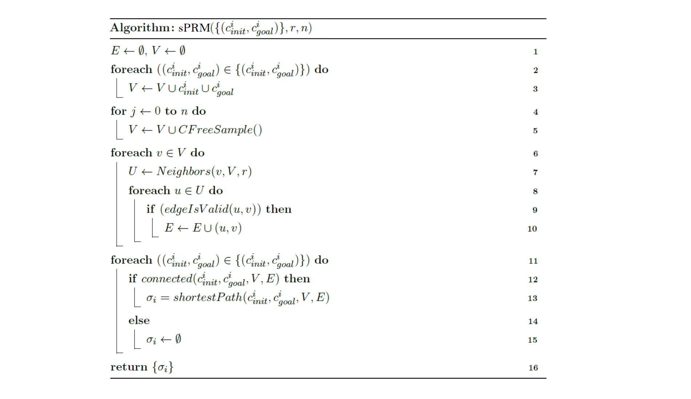
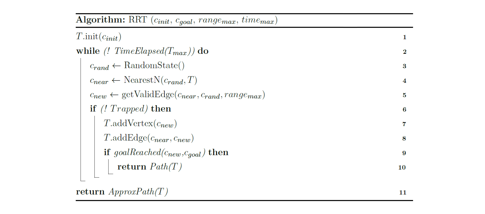

# uav-motion-planner
algorithm to generate flight paths for uav
# Motion Planning Application

This project is created from a python template for testing out some Motion Planning Algorithms. The template was created
with Python `3.7.8`.

The template was extended and updated with improvements to the template and the algorithms itself. The development was
done with Python `3.10.3` and the [dependencies](requirements.txt) were updated to this state.

### Description

This project was created within a lecture of __Datastructures and Algorithms__. It implements several functions like
__Collision Detection__ and __Motion Planning__ with calculations in the several spaces.

## Installation & Run

A virtual environment (`venv`) is used to install required packages to run the application afterwards.

### Windows

```shell
python -m venv env
.\env\Scripts\activate    
(env) $ pip install -r requirements.txt
```

```shell
.\env\Scripts\activate 
(env) $ python ./project/app.py
```

### Linux:

```shell
python3 -m venv env
source env/bin/activate
(env) $ pip install -r requirements.txt
```

```shell
source env/bin/activate
(env) $ python ./project/app.py
```

## Build Executable

To build a standalone executable the `pyinstaller` can be used. The `.exe`-file will be created with the following
command and contains all dependencies. The pyinstaller command was created with the support of `auto-py-to-exe`:

```shell
pyinstaller --noconfirm --onefile --windowed --icon "./.documents/application_icon.ico" --name "MotionPlanner" --add-data "./project/resources;.resources/"  "./project/app.py"
```

The Executable can be run by placing the resource folder in the same directory. In this folder the user can specify new
room images and new robots. Also have a look into the __Releases__ of the repository for the latest executable.

## Architecture

```
                          app.py ------ option_window
                             |
    configspace_view --- app_window --- workspace_view
            |                                 |
    --- configspace ---                   workspace
    |                 |
algorithms      collisionspace

```

<details>
  <summary>Explanation</summary>

* [app.py](project/app.py) = start the application and controls interactions
* [app_window](project/app_window.py) = main application window with child views
* [option_window](project/option_window.py) = top level option window, to select base parameters
* [workspace_view](project/workspace_view.py) = child page to display workspace
* [workspace](project/workspace.py) = calculation of initial configuration
* [configspace_view](project/configspace_view.py) = child page to display configspace
* [configspace](project/configspace.py) = calculates motions with support of collisionspace and algorithms
* [collisionspace](project/collisionspace.py) = calculated collisionspace to speed up collision detection
* [algorithms](project/algorithm_sprm.py) = algorithms like sprm to plan motions

</details>

## Algorithms

### Simplified Probabilistic RoadMaps (sPRM)

__Category:__ Sampling-based Motion Planner



__Implementation:__ [algorithm_sprm.py](./project/algorithm_sprm.py)

<details>
  <summary>Explanation</summary>

|            Input             | Explanation                                  |
|:----------------------------:|:---------------------------------------------|
| c<sup>i</sup><sub>init</sub> | Start points for single or multiple queries. |
| c<sup>i</sup><sub>goal</sub> | End points for single or multiple queries.   |
|              r               | Search radius in the algorithm.              |
|              n               | Amount of samples that are created.          |

__Note:__ The parameters r and n are completely independent and should be small for good performance, but not too small
for no solution. The best parameters are never known.

| Datastructure | Explanation                              | Interpretation       |
|:-------------:|:-----------------------------------------|:---------------------|
|       E       | edge data between two configurations     | List<(Point, Point)> |
|       V       | vertex data for all configurations       | List<Point>          |
|       U       | temporary neighbour data of a vertex     | List<Point>          |
| σ<sub>i</sub> | shortest path data for a configuration i | List<(Point, Point)> |

| Pseudocode Line | Explanation                                                                                                                                                     |
|:---------------:|:----------------------------------------------------------------------------------------------------------------------------------------------------------------|
|     2 and 3     | All start (c<sup>i</sup><sub>init</sub>) and goal (c<sup>i</sup><sub>goal</sub>) configurations are added into the vertex structure (V).                        |
|     4 and 5     | Computation of `CFreeSample()` with the amount of defined samples (n).                                                                                          |
|        7        | Computation of `Neighbors(v,V,r)` for each vertex in the defined radius (r).                                                                                    |
|     8 to 10     | Computation of `edgeIsValid(u,v)`. The valid edges get added into the valid edge structure (E). Filled E characterizes the traversable area (C<sub>free</sub>). |
|       11        | Loop enables multiple queries.                                                                                                                                  |
|       12        | Computation of `connected(...)` between start and goal.                                                                                                         |
|       13        | Computation of `shortestPath(...)` with a [Dijkstra Algorithm](https://en.wikipedia.org/wiki/Dijkstra%27s_algorithm).                                           |

__Note:__ The blocked area (C<sub>obs</sub>) is ignored in the computation of `CFreeSample()`. In the computation
of `Neighbors(v,V,r)` some vertexes (v) could be ignored because of a too small radius (r), but if r is too large, the
edge connection has quadratic complexity (O<sup>2</sup>). The computation of `Neighbors(v,V,r)` and `edgeIsValid(u,v)`
take the most performance. Parallelization of the lines 4 to 10 bring a high benefit in performance because there are
many independent calculations.

</details>

### Rapidly-exploring Random Tree (RRT)

Category: Single-Query Motion Planner



__Implementation:__ [algorithm_rrt.py](./project/algorithm_rrt.py)

<details>
  <summary>Explanation</summary>

|        Input        | Explanation                      |
|:-------------------:|:---------------------------------|
|  c<sub>init</sub>   | Start points for single queries. |
|  c<sub>goal</sub>   | End points for single queries.   |
| range<sub>max</sub> | Max vertex distance.             |
| time<sub>max</sub>  | Max time for calculation.        |

| Datastructure | Explanation                         | Interpretation |
|:-------------:|:------------------------------------|:---------------|
|       T       | tree with vertex and edge structure | Graph          |

| Pseudocode Line | Explanation                                                                                                                                 |
|:---------------:|:--------------------------------------------------------------------------------------------------------------------------------------------|
|        1        | Add (c<sup>i</sup><sub>init</sub>) to the tree.                                                                                             |
|        2        | Run algorithm while time<sub>max</sub> is not elapsed.                                                                                      |
|        3        | Calculate `RandomState()` vertex without collision.                                                                                         |
|        4        | Calculate `NearestNeighbor(...)` to c<sub>rand</sub> in the existing tree.                                                                  |
|        5        | Calculate `getValidEdge(...)` to get a new vertex on the edge between c<sub>near</sub> and c<sub>rand</sub> within the range<sub>max</sub>. |
|     6 to 8      | If the edge between c<sub>near</sub> and c<sub>new</sub> is without collision, add it to the tree.                                          |
|        9        | `goalReached(...)` if c<sub>goal</sub> and c<sub>new</sub> can be connected with the last edge.                                             |
|       10        | Computation of `shortestPath(...)` with a [Dijkstra Algorithm](https://en.wikipedia.org/wiki/Dijkstra%27s_algorithm).                       |

</details>
